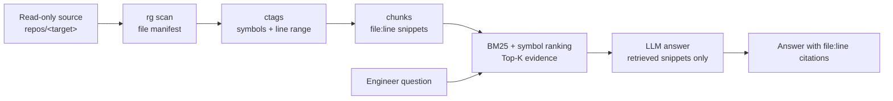
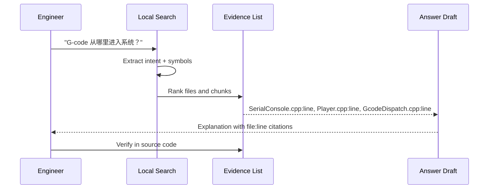
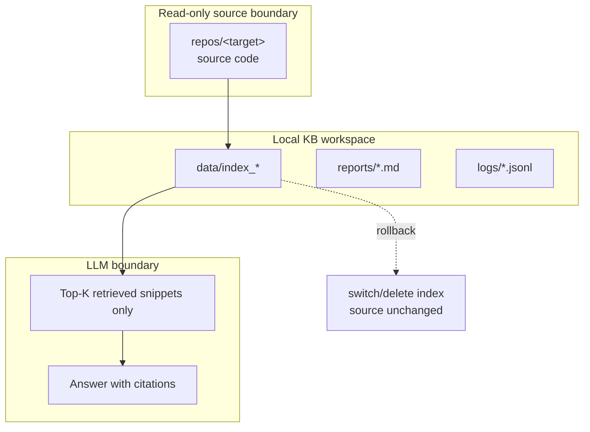

# Phase D Demo Visual Plan

目标：为软件部 5 分钟演示准备 3 个低成本动态图。动态图只用于解释系统工作方式，不用于包装成营销页，也不暗示系统已经具备自动修代码、完整调用图或 100% 准确能力。

## 设计原则

- 优先使用 Mermaid 或静态 HTML；必要时再从 HTML 录制 GIF。
- 不引入新依赖，不修改检索算法，不修改 `repos/**`。
- 每个动态图只表达一个工程事实：输入是什么、经过哪些本地步骤、输出哪些可核查证据。
- 动画节奏要服务 5 分钟口头讲解，每张图控制在 30-60 秒。
- 画面不要出现“AI 自动理解整个代码库”“自动生成修复”“直接写 SVN”这类误导信号。

## 图 1：检索流水线图

### 目标观众

软件部负责人、代码库 owner、对安全边界和实施成本敏感的工程师。

### 要表达的工程事实

系统不是把代码库整包发给 LLM，而是在本地先做只读扫描、符号抽取、chunk 构建和 BM25/符号检索。LLM 只接收检索后的少量片段，用来组织解释和引用。

### 动画步骤

1. 高亮只读源码目录：`repos/<target>/`。
2. 依次点亮本地索引步骤：`rg scan` -> `ctags symbols` -> `chunks` -> `BM25 + symbol hints`。
3. 输入一个工程问题，例如“报警触发后从哪里进入停机逻辑？”。
4. 高亮 Top-K 检索结果：文件、符号、行号、片段。
5. 最后才点亮 LLM answer，并标注“only retrieved snippets”。

### 可用实现方式

- Mermaid：用 `flowchart LR` 做分阶段高亮；适合放进 Markdown 或演示稿。
- 静态 HTML：用 CSS class 和少量内联 JS 做 step-by-step 高亮；适合现场演示。
- GIF：从 HTML 录屏导出；适合无法现场运行页面时兜底。
- PowerPoint：用出现/强调动画逐步展示；适合发给软件部留档。

Mermaid 草图：

### 不应该展示什么，避免误导

- 不展示“全仓库上传到云端模型”。
- 不展示“自动训练公司代码模型”。
- 不展示“完整精确调用图”，当前 mention graph 不能覆盖所有动态分发。
- 不展示“直接产出 patch / commit / SVN 修改”，Phase D 只做只读定位与解释。

## 图 2：问题到文件:行号引用的定位图

### 目标观众

一线开发、维护工程师、后续负责验证 10 个真实问题的人。

### 要表达的工程事实

系统的价值不是“给一个听起来合理的回答”，而是把自然语言问题落到可打开、可复核的文件和行号。回答必须能被工程师沿着引用回到源码验证。

### 动画步骤

1. 左侧出现问题卡片：例如“G-code 从哪里进入系统？”。
2. 问题中的符号/意图 token 被高亮：`G-code`、`进入`、`入口`。
3. 中间出现候选排序列表：`SerialConsole.cpp`、`Player.cpp`、`GcodeDispatch.cpp`。
4. 每个候选展开一条 evidence：`file:line` + symbol + 2-3 行 snippet。
5. 右侧形成短回答：结论只引用已经出现的 evidence。
6. 最后出现人工核查动作：工程师点击文件行号回到源码。

### 可用实现方式

- Mermaid：用 `sequenceDiagram` 表达“问题 -> 检索 -> 证据 -> 回答”。
- 静态 HTML：三栏布局，左问题、中 evidence、右答案；用按钮切换步骤。
- GIF：录制 HTML 的逐步高亮版本。
- PowerPoint：适合演示真实 10 题时快速替换文本和文件名。

Mermaid 草图：

### 不应该展示什么，避免误导

- 不展示没有来源的长篇解释。
- 不展示“AI 直接判断正确”，必须保留工程师核查。
- 不展示只命中一个文件就宣称完整理解；流程、状态机、报警链路通常跨模块。
- 不把 Smoothieware 的文件名包装成 wire bonder 已验证结果；只能说“演示映射方式”。

## 图 3：安全边界图

### 目标观众

软件部负责人、信息安全/配置管理人员、担心代码外发和 SVN 风险的人。

### 要表达的工程事实

系统边界是只读、可回滚、可本地运行。源码目录不被修改，索引产物写到独立目录，LLM 只看检索片段；后续也可以切换到离线模型。

### 动画步骤

1. 左侧显示只读源码目录，标注“不写回，不提交 SVN”。
2. 中间显示本地工作区：`data/`、`reports/`、`logs/`。
3. 用单向箭头表示源码只流向本地索引，不反向写回。
4. 高亮“Top-K snippets”作为唯一可进入 LLM 的内容。
5. 显示回滚路径：删除/切换索引目录即可恢复，不影响源码仓库。
6. 最后一屏列出 Phase D 试点申请：非核心只读目录 + 10 个真实问题。

### 可用实现方式

- Mermaid：用 `flowchart TB` 和 subgraph 表达可信边界。
- 静态 HTML：用边界框和锁图标表达只读、本地、可回滚。
- GIF：录制箭头逐步出现，适合放在开场或收尾。
- PowerPoint：适合给软件部负责人转发。

Mermaid 草图：

### 不应该展示什么，避免误导

- 不展示对 `repos/**` 的写入箭头。
- 不展示 SVN/Git commit、patch apply、自动重构。
- 不展示 API key、真实路径中的敏感项、完整私有代码片段。
- 不承诺“绝不泄露”这种不可验证表述；应表达可执行控制：只读目录、片段级上下文、离线模型可选、日志本地保存。

## 最小实现建议

### 第一版：Markdown + Mermaid

最小可交付是把上面 3 个 Mermaid 图直接放进 `docs/demo_script.md` 或单独演示页中。优点是无依赖、易审查、能随文档一起版本管理。缺点是动画能力有限，主要靠演讲节奏逐步讲解。

建议优先做这一版，因为 Phase D 的核心目标是获得软件部允许：一个非核心只读目录和 10 个真实问题。动态图只需要降低沟通成本，不应该变成新的前端项目。

### 第二版：单文件静态 HTML

如果 Mermaid 不够直观，再新增一个 `docs/demo_visual.html`。它应是单文件、无外链依赖、无构建步骤，只用 HTML/CSS/少量 JS 做步骤切换。每张图一个 `<section>`，用 `Next` 按钮推进高亮。

建议 HTML 只实现：

- 三张图的 step 切换。
- 文件、行号、snippet 的示意占位。
- 安全边界的单向箭头和 rollback 标注。

不建议实现：

- 复杂交互式图编辑器。
- 真实源码浏览器。
- 前端框架、打包器或新依赖。
- 任何会调用检索器或 LLM 的在线交互。

### 第三版：录屏 GIF 或 PowerPoint

如果演示现场环境不稳定，可以从第二版 HTML 录制 3 个 GIF，或直接用 PowerPoint 动画重做。GIF/PowerPoint 是演示材料，不应成为系统功能的一部分。

## 审查结论

- 我不同意把“动态图”当作产品功能来做。
- 为什么这可能是错的：Phase D 的关键风险不是视觉表现，而是软件部是否愿意给只读目录和真实问题。重前端会偏离试点主线，也会增加维护面。
- 这个问题的严重程度：中风险。
- 更好的替代方案：先用 Mermaid 或单文件静态 HTML 做 5 分钟演示辅助材料。
- 下一步应该验证什么：软件部是否能从这 3 张图清楚理解只读边界、片段级 LLM 输入、file:line 可核查输出，并愿意提供非核心只读目录和 10 个真实问题。
